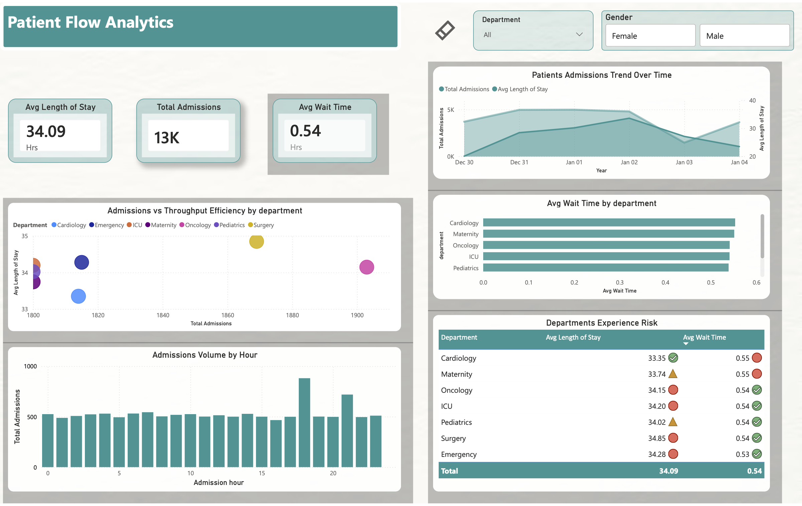

# Real-Time Patient Flow Analytics

## 🧠 Problem Context

Hospitals rarely struggle because of a single bottleneck. Operational pressure builds when patient arrivals, wait times, and length of stay compound across departments. Most reporting systems surface volume metrics but fail to explain **why** congestion persists or **where** efficiency breaks down.

This project focuses on **operational patient flow**, treating each patient interaction as an event and analyzing how flow dynamics evolve over time. The intent is to expose pressure points that are invisible in static or batch-based reports.

---

## 🎯 Objectives

This system converts raw patient flow events into actionable operational insight.

Key goals:

- Capture patient activity as a **continuous real-time stream**
- Enforce **data quality before analytics consumption**
- Model data for **operational analysis**, not raw reporting
- Enable flexible analytics **without data duplication**
- Deliver insights that support **capacity planning and process optimization**

The focus is on understanding **system behavior**, not just measuring outcomes.

---

## 📁 Repository Structure

The repository mirrors the logical stages of a real-time analytics system, from event generation to insight delivery:


```
real-time-patient-flow-analytics/
│
├── simulator/
│   └── patient_event_producer.py
│   # Generates real-time patient flow events
│
├── databricks-notebooks/
│   ├── 01_eventhub_stream_ingestion.py
│   ├── 02_data_validation_and_cleansing.py
│   └── 03_analytics_data_model.py
│   # Streaming ingestion, data quality enforcement, analytics modeling
│
├── sqlpool-queries/
│   └── SQL_pool_queries.sql
│   # Serverless SQL views for analytics access
│
├── power-bi/
│   └── healthcare.pbix
│   # Operational dashboard built on analytical views
│
├── .gitignore
└── README.md
```


Each layer is isolated by responsibility, making the system easier to reason about, modify, and version using Git.

---

## 🛠 Tech Stack

Each component exists for a clear operational reason:

- **Azure Event Hub** – scalable real-time ingestion  
- **Azure Databricks (PySpark)** – streaming transformation and validation  
- **Azure Data Lake Storage Gen2** – durable lakehouse storage  
- **Azure Synapse Serverless SQL** – analytics access without infrastructure overhead  
- **Power BI** – controlled delivery of insights  
- **Git & GitHub** – version control, traceability, and collaboration  

The stack supports real-time analytics with engineering discipline, not overengineering.

---

## 🔄 Data Flow Architecture

The system follows an event-driven, layered design:

### 🥉 Bronze – Raw Event Capture
- Stores raw JSON events
- Preserves source payloads
- Enables replay and traceability

### 🥈 Silver – Validated Events
- Schema enforcement
- Invalid age correction
- Future timestamp handling
- Timestamp consistency guarantees

### 🥇 Gold – Analytical Tables
- Fact and dimension tables
- Business-ready structure
- Optimized for aggregation and slicing

---

## ⭐ Analytical Data Model

The Gold layer implements a simple star schema.

### 📌 Fact Table
- Patient events  
  - Admission time  
  - Discharge time  
  - Wait time  
  - Length of stay  

### 📌 Dimension Tables
- Patient  
- Department  

The model is intentionally minimal. Advanced historical modeling was avoided to keep analytics **clear, stable, and defensible**.

---

## ⚙️ Pipeline Logic

Instead of step-by-step setup instructions, the pipeline is organized by capability:

- **Streaming Ingestion**  
  Continuous event consumption via a Kafka-compatible interface  

- **Data Validation & Enrichment**  
  Business-rule enforcement and anomaly handling  

- **Analytics Modeling**  
  Fact and dimension construction with surrogate keys  

- **Analytics Access**  
  Serverless SQL views over Delta tables (schema-on-read)  

All pipeline changes are tracked through Git, enabling safe iteration and rollback.

---

## 📊 Operational Dashboard

The dashboard is designed to support **real-time operational decision-making**, not retrospective reporting.

### Dashboard Focus

It answers a small set of critical operational questions:

- How does patient demand evolve over time and within the day?
- Which departments sustain higher admissions without throughput degradation?
- Where does capacity pressure emerge due to extended length of stay?
- When do demand peaks create staffing and resource misalignment?
- Which departments carry the highest patient experience risk?

A static image of the dashboard is included below for quick reference.




## 📈 Insights Delivered

The system enables several actionable insights:

- Operational pressure is **not driven by admissions volume alone**
- Average wait time remains relatively consistent across departments
- **Length of stay** is the dominant driver of patient experience risk
- Some departments absorb higher demand without proportional inefficiency
- Demand peaks at specific hours, exposing staffing misalignment

These insights shift focus from **“we’re busy”** to **“where flow efficiency breaks down.”**
